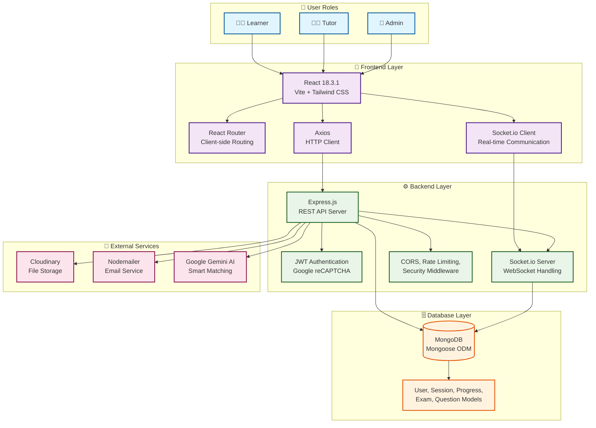
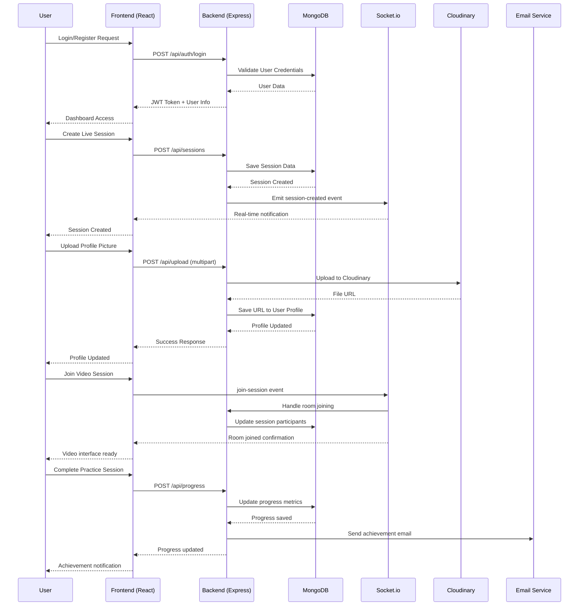
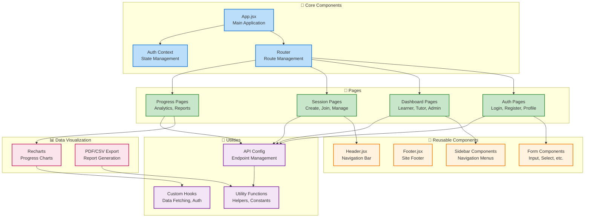
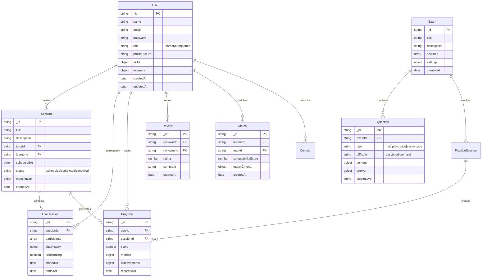
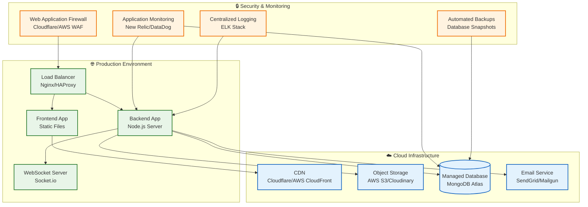

# 🌱 LearingSphere - Comprehensive Learning Management System

[](https://reactjs.org/)
[](https://nodejs.org/)
[](https://mongodb.com/)
[](https://socket.io/)
[](https://www.google.com/recaptcha/)
[](https://learningsphere-1fgj.onrender.com)

[🚀 **Live Demo**](https://learningsphere-1fgj.onrender.com) | [📖 Documentation](#-complete-feature-documentation) | [🛠️ Installation](#-installation--setup)

LearingSphere is a feature-rich, full-stack learning management platform that connects learners with tutors through personalized matching, gamified progress tracking, and comprehensive session management. Built with modern web technologies and designed for scalability, it features an advanced assessment system with sectional exams, adaptive practice sessions, and AI-powered performance analytics.

## ✨ **Key Features**

### **🎓 Learning Management**
- **AI-Powered Matching**: Smart learner-tutor pairing based on skills, interests, and availability
- **Real-time Sessions**: Live video/audio sessions with screen sharing capabilities
- **Progress Tracking**: Comprehensive analytics with XP, badges, and level progression
- **Gamification**: Achievement system with leaderboards and streak tracking

### **📚 Advanced Assessment System**
- **Sectional Exams**: Multi-difficulty testing with adaptive progression
- **Practice Sessions**: Adaptive learning with real-time feedback
- **Intelligent Questions**: Bloom's Taxonomy-based question management
- **Performance Analytics**: Detailed insights with graphs and predictions

### **👥 User Management**
- **Role-based Access**: Separate dashboards for learners, tutors, and admins
- **Profile Management**: Comprehensive user profiles with skills and interests
- **Secure Authentication**: JWT-based auth with Google reCAPTCHA integration
- **Email Notifications**: Automated reminders and achievement notifications

### **📊 Analytics & Reporting**
- **Interactive Dashboards**: Real-time progress visualization
- **Custom Reports**: Downloadable PDF/CSV reports
- **Performance Prediction**: AI-driven future performance forecasting
- **Comparative Analysis**: Peer comparison and personal best tracking

## 🚀 **Core System Architecture**

### **System Overview**



### **Data Flow Architecture**



### **Component Architecture**



### **Database Schema Overview**



### **Deployment Architecture**



---

### **Frontend Stack**
- **React 18.3.1** - Modern component-based UI
- **Vite** - Lightning-fast build tool and dev server
- **Tailwind CSS 4.1.13** - Utility-first CSS framework
- **React Router Dom 6.30.1** - Client-side routing
- **Socket.io Client 4.8.1** - Real-time communication
- **Lucide React** - Modern icon library
- **Axios** - HTTP client for API calls

### **Backend Stack**
- **Node.js & Express 4.18.2** - Server framework
- **MongoDB & Mongoose 7.5.0** - Database & ODM
- **Socket.io 4.7.2** - Real-time bidirectional communication
- **JWT (jsonwebtoken 9.0.2)** - Authentication & authorization
- **BCrypt.js** - Password hashing
- **Nodemailer 6.9.7** - Email service integration
- **Cloudinary** - File upload and media management
- **Multer** - File upload middleware
- **Helmet** - Security middleware

---

## 📋 **Complete Feature Documentation**

## 🔐 **Authentication & User Management System**

### **User Registration & Login**
- ✅ **Secure Registration** with email validation
- ✅ **Encrypted Password Storage** using BCrypt
- ✅ **JWT-based Authentication** with token persistence
- ✅ **Email Verification System** with automatic frontend redirect and notification
- ✅ **Password Reset Functionality** with secure token generation
- ✅ **Role-based Access Control** (Admin, Tutor, Learner)
- ✅ **Profile Management** with interests, skills, and location
- ✅ **Account Status Management** (verified/unverified)
- 🔒 **Google reCAPTCHA Integration** - Advanced bot protection for login forms

### **User Roles & Permissions**
- 🎓 **Learner Role**: Access to sessions, progress tracking, matching
- 👨‍🏫 **Tutor Role**: Session creation, learner management, analytics
- 🔧 **Admin Role**: System-wide management, user oversight, badge assignment
- 🔄 **Role Switching**: Dynamic role changes with proper authorization

---

## 🎯 **Smart Matching System**

### **AI-Powered Learner-Tutor Matching**
- ✅ **Skill-based Matching Algorithm** - Matches based on tutor expertise and learner needs
- ✅ **Interest Compatibility Scoring** - Considers shared interests and learning preferences
- ✅ **Location-aware Matching** - Geographic proximity consideration
- ✅ **Availability Synchronization** - Time zone and schedule compatibility
- ✅ **Learning Style Compatibility** - Visual, auditory, kinesthetic matching
- ✅ **Experience Level Matching** - Beginner, intermediate, advanced level pairing
- ✅ **Success Rate Analytics** - Historical performance-based recommendations
- ✅ **Preference Learning** - System learns from past successful matches

### **Advanced Matching Features**
- 🎯 **Multi-criteria Scoring** - Comprehensive compatibility assessment
- 📊 **Match Confidence Rating** - Percentage-based match quality indicator
- 🔄 **Dynamic Re-matching** - Continuous optimization based on feedback
- 📈 **Performance-based Adjustments** - Algorithm improves over time

---

## 📚 **Session Management System**

### **Session Types & Creation**
- ✅ **Regular Sessions** - One-on-one tutor-learner sessions
- ✅ **Live Group Sessions** - Multi-participant real-time sessions
- ✅ **Scheduled Sessions** - Pre-planned time-based sessions
- ✅ **Instant Sessions** - On-demand immediate sessions
- ✅ **Video & Audio Sessions** - Flexible communication modes
- ✅ **Recording Capabilities** - Session recording with Cloudinary storage

### **Session Features**
- 🕐 **Smart Scheduling** - Automated time conflict detection
- 📧 **Email Reminders** - 30-minute pre-session notifications
- 🔗 **Meeting Link Generation** - Automatic WebRTC room creation
- 👥 **Participant Management** - Join/leave tracking
- 📊 **Session Analytics** - Duration, participation, and effectiveness metrics
- 🎥 **Media Upload** - Recording upload and management
- 💬 **Real-time Chat** - In-session messaging system

### **Session Status Management**
- 📅 **Scheduled** - Future planned sessions
- 🔴 **Live** - Currently active sessions
- ✅ **Completed** - Finished sessions with recordings
- ❌ **Cancelled** - Cancelled sessions with notifications

---

## 🏆 **Comprehensive Gamification System**

### **Badge System**
- 🌱 **Noobie Badge** - Automatic award on registration (0 XP, +50 XP reward)
- 🐦 **Early Bird Badge** - Awarded at 500 XP (+100 XP reward)
- 🎓 **Expert Badge** - Awarded at 2000 XP (+200 XP reward)
- 👑 **Master Badge** - Awarded at 5000 XP (+500 XP reward)
- 🎯 **First Steps Badge** - Complete first session (+25 XP reward)
- ⚡ **Session Warrior Badge** - Complete 10 sessions (+150 XP reward)
- 🏆 **Session Champion Badge** - Complete 50 sessions (+300 XP reward)
- 📺 **Live Enthusiast Badge** - Attend 5 live sessions (+100 XP reward)
- 🔥 **Consistent Learner Badge** - 7-day learning streak (+200 XP reward)
- ⏰ **Time Master Badge** - 100+ learning hours (+400 XP reward)

### **Experience Point (XP) System**
- ✅ **Registration Reward** - 50 XP (Noobie badge)
- ✅ **Session Joining** - 100 XP per regular session
- ✅ **Live Session Bonus** - 150 XP per live session (100 + 50 bonus)
- ✅ **Session Completion** - 50 XP + time-based XP (25 XP per hour)
- ✅ **Badge Rewards** - Variable XP from badge achievements
- ✅ **Level Progression** - 1000 XP per level advancement

### **Progress Tracking**
- 📊 **Detailed Statistics** - Sessions, hours, XP, levels, badges
- 📈 **Performance Analytics** - Progress over time
- 🏅 **Achievement Milestones** - Major progress markers
- 📱 **Real-time Updates** - Instant progress reflection
- 🔥 **Streak Tracking** - Daily learning streaks with longest streak records

### **Leaderboard System**
- 🥇 **Global Rankings** - XP-based user rankings
- 📊 **Multiple Leaderboards** - Sessions, XP, badges, hours
- 🎯 **Category Filtering** - Learners vs Tutors rankings
- 📈 **Historical Tracking** - Progress over time visualization

---

## 🧠 **Advanced Assessment & Testing System**

### **Sectional Exams**
- 📚 **Multi-Section Testing** - Comprehensive exams divided into difficulty-based sections
- 🎯 **Adaptive Difficulty** - Very Easy → Easy → Moderate → Difficult progression
- ⏱️ **Time-Bound Sections** - 30-minute timer per section with automatic progression
- 📊 **Section-wise Analytics** - Individual performance tracking per difficulty level
- ✅ **Pass/Fail Criteria** - 40% accuracy threshold per section to advance
- 🔄 **Section Switching** - Manual navigation between completed sections
- 🏆 **XP Rewards** - 50 XP per successfully completed section
- 📈 **Performance Prediction** - AI-driven difficulty adjustment based on user performance

### **Practice Exams**
- 🎮 **Adaptive Learning** - Dynamic question difficulty based on user performance
- 📊 **Real-time Feedback** - Instant correctness indication and explanations
- ⏰ **Flexible Timing** - 60-minute default sessions with customizable duration
- 📈 **Performance Analytics** - Detailed accuracy tracking and improvement metrics
- 🎯 **Smart Question Selection** - Algorithm-based question curation
- 💰 **XP Earning** - 10 XP per correct answer in practice sessions
- 📚 **Question Bank** - Extensive database with categorized questions
- 📊 **Progress Tracking** - Historical practice session performance

### **Intelligent Questioning Model**
- 🏷️ **Advanced Tagging System** - Subject-based and topic-specific categorization
- 📊 **Question Statistics** - Success rates, attempt counts, and difficulty metrics
- 🎯 **Bloom's Taxonomy Integration** - Cognitive level classification (Remember, Understand, Apply, Analyze, Evaluate, Create)
- 🔄 **Dynamic Difficulty Adjustment** - Real-time question difficulty modification
- 📈 **Performance-based Adaptation** - Question selection based on user proficiency
- ✅ **Answer Validation** - Automated correctness checking with detailed explanations
- 📊 **Question Analytics** - Usage statistics and performance insights
- 👨‍🏫 **Tutor Question Management** - Authorized tutors can create and manage questions

### **Comprehensive Analytics & Insights**
- 📊 **Performance Prediction** - Machine learning-based future performance forecasting
- 📈 **Detailed Graphs** - Interactive charts for XP growth, exam performance, and learning trends
- 🎯 **Personalized Recommendations** - AI-driven study suggestions and improvement areas
- 📚 **Subject-wise Analysis** - Performance breakdown by topics and difficulty levels
- 📈 **Progress Visualization** - Multi-dimensional progress tracking with historical data
- 🎯 **Weakness Identification** - Automated detection of knowledge gaps
- 📋 **Custom Reports** - Downloadable PDF and CSV reports with comprehensive analytics
- 📊 **Comparative Analysis** - Performance comparison with peers and personal bests

### **Advanced Gamification Features**
- 🏆 **Dynamic Badge System** - 10+ achievement badges with XP rewards
- 📊 **Level Progression** - 1000 XP per level with visual progress indicators
- 🔥 **Streak Tracking** - Daily learning streaks with longest streak records
- 🥇 **Global Leaderboards** - Real-time rankings with multiple categories
- 📈 **XP Visualization** - Interactive charts showing experience point growth
- 🎯 **Achievement Milestones** - Major progress markers and celebrations
- 📱 **Real-time Updates** - Instant progress reflection and badge notifications
- 🎨 **Customizable Profiles** - Personalized user dashboards with achievement showcases

---

### **User Management**
- ✅ **User Overview** - Complete user statistics and management
- ✅ **Role Management** - Assign/modify user roles
- ✅ **Account Status Control** - Enable/disable accounts
- ✅ **Profile Verification** - Manual verification process
- ✅ **User Analytics** - Registration trends, activity patterns

### **Session Management**
- 📊 **Session Statistics** - Total sessions, completion rates
- 🕐 **Session Monitoring** - Real-time session tracking
- 📈 **Performance Metrics** - Success rates, duration analysis
- 🔍 **Session Search** - Advanced filtering and search capabilities

### **Badge Administration**
- 🏆 **Manual Badge Assignment** - Admin-awarded special badges
- 📊 **Badge Statistics** - Distribution and earning analytics
- 👥 **User Badge Management** - View and manage user badges
- 📈 **Badge Performance** - Badge engagement and motivation analytics
- 🎨 **Custom Badge Creation** - Create special administrative badges

### **System Analytics**
- 📈 **User Growth Metrics** - Registration and retention analytics
- 📊 **Engagement Statistics** - Session participation, completion rates
- 💰 **Revenue Analytics** - Financial performance tracking
- 🎯 **Matching Efficiency** - Matching algorithm performance
- 📱 **Platform Usage** - Feature adoption and usage patterns

---

## 🔄 **Real-time Communication System**

### **Socket.io Integration**
- ✅ **Real-time Session Updates** - Live session status changes
- ✅ **Instant Messaging** - In-session chat functionality
- ✅ **Participant Tracking** - Join/leave notifications
- ✅ **Status Broadcasting** - User online/offline status
- ✅ **Notification System** - Real-time alerts and updates

### **WebRTC Integration**
- 🎥 **Video Calling** - Peer-to-peer video communication
- 🎤 **Audio Calling** - Voice-only session support
- 📱 **Screen Sharing** - Educational content sharing
- 🔧 **Connection Management** - Automatic reconnection handling

---

## 📧 **Email Communication System**

### **Email Templates**
- ✅ **Welcome Emails** - Account verification with branded templates
- ✅ **Session Reminders** - 30-minute advance notifications
- ✅ **Password Reset** - Secure password recovery emails
- ✅ **Session Confirmations** - Booking confirmations with details
- ✅ **Cancellation Notices** - Session cancellation notifications
- ✅ **Achievement Notifications** - Badge and milestone celebrations

### **Email Features**
- 🎨 **Responsive Design** - Mobile-friendly email templates
- 📧 **SMTP Integration** - Gmail and custom SMTP support
- ✅ **Delivery Tracking** - Email sent/delivered status
- 🔄 **Automated Sending** - Scheduled and triggered emails

---

## 🎨 **User Interface & Experience**

### **Responsive Design**
- 📱 **Mobile-first Approach** - Optimized for all devices
- 🖥️ **Desktop Optimization** - Full-featured desktop experience
- 📱 **Tablet Support** - Optimized tablet interface
- 🌓 **Modern UI Components** - Consistent design language

### **Navigation & Routing**
- 🧭 **Intuitive Navigation** - Clear menu structure
- 🔒 **Protected Routes** - Role-based access control
- 📊 **Dynamic Dashboards** - Personalized user dashboards
- 🔍 **Advanced Search** - Multi-criteria search functionality

### **Interactive Components**
- 📊 **Charts & Graphs** - Progress visualization
- 🎯 **Interactive Forms** - Real-time validation
- 🔔 **Notification System** - In-app notifications
- 🎨 **Icon Integration** - Lucide React icon library

---

## 📊 **Progress Tracking & Analytics**

### **Learner Progress Dashboard**
- 📈 **XP Progression** - Experience points over time with interactive line charts
- 🏅 **Badge Collection** - Earned badges showcase with achievement timelines
- 📊 **Session Statistics** - Completed sessions, hours, and performance metrics
- 🎯 **Goal Tracking** - Personal learning goals with progress indicators
- 🔥 **Streak Visualization** - Learning streak calendar with longest streak records
- 📱 **Mobile Progress View** - Progress on-the-go with responsive design
- 📊 **Performance Prediction** - AI-driven forecasting of future performance trends
- 📈 **Detailed Analytics** - Comprehensive graphs showing learning patterns and improvements

### **Advanced Analytics Features**
- 📊 **Interactive Charts** - Recharts-powered visualizations for XP growth, exam scores, and activity trends
- 🎯 **Subject Performance Analysis** - Detailed breakdown by topics with accuracy percentages
- 📈 **Score Distribution Graphs** - Visual representation of performance across different ranges
- 📊 **Badge Distribution Charts** - Pie charts showing achievement categories
- 📈 **Time-based Progress Tracking** - Historical data visualization over 30-day periods
- 🎯 **Weakness Detection** - Automated identification of knowledge gaps and improvement areas
- 📋 **Custom Report Generation** - Downloadable PDF and CSV reports with comprehensive data
- 📊 **Comparative Analytics** - Performance comparison with personal bests and peer averages

### **Tutor Analytics Dashboard**
- 👥 **Student Overview** - Managed learner statistics and progress tracking
- 📊 **Session Analytics** - Teaching session metrics with detailed performance data
- 💰 **Earnings Tracking** - Revenue and payment history with financial analytics
- ⭐ **Rating & Reviews** - Student feedback compilation with sentiment analysis
- 📈 **Performance Trends** - Teaching effectiveness metrics over time
- 📊 **Student Progress Monitoring** - Individual learner advancement tracking
- 🎯 **Custom Recommendations** - AI-suggested teaching strategies based on student performance
- 📈 **Engagement Analytics** - Student participation and interaction metrics

### **Global Analytics**
- 🌍 **Platform Statistics** - System-wide metrics and usage patterns
- 📊 **User Engagement** - Activity and retention rates with trend analysis
- 🎯 **Matching Success** - Algorithm performance metrics and success rates
- 📈 **Growth Metrics** - User acquisition and retention with predictive modeling
- 📊 **Performance Insights** - Comprehensive analytics for platform optimization
- 🎯 **Learning Effectiveness** - Measurement of educational outcomes and improvements

---

## 🔧 **Technical Infrastructure**

### **Database Architecture**
- 🗃️ **MongoDB Collections**:
  - **Users** - Authentication and profile data
  - **Sessions** - Session information and metadata
  - **LiveSessions** - Real-time session data
  - **Progress** - XP, badges, and achievements
  - **Reviews** - Feedback and rating system
  - **Matches** - Matching algorithm results
  - **Questions** - Intelligent question bank with statistics
  - **PracticeSession** - Adaptive practice exam tracking
  - **Exam** - Comprehensive exam management

### **API Architecture**
- 🔗 **RESTful API Design** - Standard HTTP methods
- 🔐 **JWT Authentication** - Secure API access
- 📊 **Comprehensive Endpoints**:
  - Authentication routes (`/api/auth`)
  - User management (`/api/users`)
  - Session operations (`/api/sessions`)
  - Progress tracking (`/api/progress`)
  - Matching system (`/api/matching`)
  - Review system (`/api/reviews`)
  - Admin operations (`/api/admin`)
  - Contact system (`/api/contact`)
  - **Exam Management** (`/api/exams`) - Full exam lifecycle management
  - **Practice Sessions** (`/api/practice`) - Adaptive practice exam system
  - **Question Bank** (`/api/questions`) - Intelligent question management
  - **Reports & Analytics** (`/api/reports`) - Comprehensive reporting system

### **Security Features**
- 🔒 **Password Encryption** - BCrypt hashing
- 🛡️ **Helmet Security** - HTTP security headers
- 🚫 **CORS Configuration** - Cross-origin request handling
- 🔐 **JWT Token Management** - Secure authentication
- ✅ **Input Validation** - Request data validation
- 🔄 **Rate Limiting** - API abuse prevention

### **File Management**
- ☁️ **Cloudinary Integration** - Image and video storage
- 📁 **Multer Middleware** - File upload handling
- 🎥 **Recording Storage** - Session recording management
- 🖼️ **Profile Pictures** - User avatar management

---

## 🚀 **Advanced Features**

### **Smart Matching Algorithm**
- 🧠 **Machine Learning Ready** - Extensible for ML integration
- 📊 **Multi-factor Scoring** - Comprehensive compatibility analysis
- 🔄 **Continuous Learning** - Algorithm improvement over time
- 🎯 **Success Rate Optimization** - Performance-based adjustments

### **Notification System**
- 🔔 **Real-time Notifications** - Instant updates via Socket.io
- 📧 **Email Notifications** - Important event alerts
- 🔕 **Notification Preferences** - User-controlled notification settings
- 📱 **Push Notification Ready** - Future mobile app integration

### **Review & Rating System**
- ⭐ **5-Star Rating System** - Comprehensive feedback
- 💬 **Detailed Reviews** - Text-based feedback
- 📊 **Rating Analytics** - Performance tracking
- 🎯 **Improvement Insights** - Constructive feedback analysis

---

## 🛠️ **Development & Deployment**

### **Development Environment**
- 🔄 **Hot Reloading** - Vite development server
- 🐛 **Debugging Tools** - Comprehensive error handling
- 📝 **Code Linting** - ESLint integration
- 🧪 **Testing Ready** - Test framework integration ready

### **Production Features**
- ⚡ **Performance Optimization** - Efficient bundle sizes
- 🔒 **Security Hardening** - Production security measures
- 📊 **Monitoring Ready** - Application performance monitoring
- 🚀 **Scalability Prepared** - Horizontal scaling architecture

---

## 📱 **Mobile Responsiveness**

### **Cross-Device Compatibility**
- 📱 **Mobile Optimization** - Touch-friendly interfaces
- 📱 **Progressive Web App Ready** - PWA capabilities
- 🖥️ **Desktop Experience** - Full-featured desktop UI
- 📱 **Tablet Optimization** - Medium-screen experiences

---

## 🔮 **Future-Ready Architecture**

### **Extensibility Features**
- 🔌 **Plugin Architecture** - Modular feature additions
- 🌍 **Internationalization Ready** - Multi-language support preparation
- 🎨 **Theme System** - Customizable UI themes
- 📊 **Analytics Integration** - Third-party analytics ready

### **Integration Capabilities**
- 💳 **Payment Gateway Ready** - Stripe/PayPal integration prepared
- 📱 **Mobile App Integration** - React Native compatibility
- 🤖 **AI/ML Integration** - Machine learning model integration
- 📈 **Business Intelligence** - Advanced analytics integration

---

## 📋 **Installation & Setup**

### **Prerequisites**
- Node.js (v16 or higher)
- MongoDB (v5.0 or higher)
- NPM or Yarn package manager

### **Backend Setup**
```bash
cd LearingSphere-backend
npm install
# Configure environment variables in .env file
npm start
```

### **Frontend Setup**
```bash
cd frontend
npm install
npm run dev
```

### **Environment Variables**
```env
# Database
MONGODB_URI=mongodb://localhost:27017/LearingSphere

# JWT Secret
JWT_SECRET=your_jwt_secret_key

# Email Configuration
AUTH_EMAIL=your_email@gmail.com
AUTH_PASS=your_email_password

# Cloudinary Configuration
CLOUDINARY_CLOUD_NAME=your_cloud_name
CLOUDINARY_API_KEY=your_api_key
CLOUDINARY_API_SECRET=your_api_secret
```

---

## 🖼️ **Screenshots**

### **Dashboard Overview**


### **Gamified Progress Tracking**


### **Sectional Exam Interface**


### **Real-time Video Sessions**


### **Analytics & Reports**


---

## 🚀 **Getting Started**

### **Quick Start**

1. **Clone the repository**

   ```bash
   git clone https://github.com/Piyush11204/LearningSphere.git
   cd LearningSphere
   ```

2. **Install dependencies**

   ```bash
   # Backend
   cd backend
   npm install

   # Frontend
   cd ../frontend
   npm install
   ```

3. **Set up environment variables**
   - Copy `.env.example` to `.env` in the backend directory
   - Configure your MongoDB, JWT, email, and Cloudinary settings

4. **Start the development servers**

   ```bash
   # Backend (Terminal 1)
   cd backend
   npm start

   # Frontend (Terminal 2)
   cd frontend
   npm run dev
   ```

5. **Access the application**
   - Frontend: `http://localhost:5173`
   - Backend API: `https://learningsphere-1fgj.onrender.com`

### **First Time Setup**

1. **Register as an Admin** - First user registered becomes admin
2. **Create Tutors** - Add tutor accounts through admin panel
3. **Set up Questions** - Tutors can add questions to the question bank
4. **Create Exams** - Admins can schedule exams and sectional tests
5. **Start Learning** - Learners can now browse tutors and take exams

### **Production Deployment**

- **Backend**: Deploy to services like Heroku, Railway, or Render
- **Frontend**: Deploy to Vercel, Netlify, or GitHub Pages
- **Database**: Use MongoDB Atlas for cloud database
- **File Storage**: Configure Cloudinary for media uploads

---

## 📡 **API Documentation**

### **Core Endpoints**

#### **Authentication**

- `POST /api/auth/register` - User registration
- `POST /api/auth/login` - User login
- `POST /api/auth/logout` - User logout
- `GET /api/auth/profile` - Get user profile

#### **User Management API**

- `GET /api/users` - Get all users (Admin only)
- `PUT /api/users/:id` - Update user profile
- `DELETE /api/users/:id` - Delete user (Admin only)

#### **Sessions & Live Learning**

- `GET /api/sessions` - Get all sessions
- `POST /api/sessions` - Create new session
- `GET /api/sessions/:id` - Get session details
- `PUT /api/sessions/:id` - Update session
- `DELETE /api/sessions/:id` - Delete session

#### **Matching System**

- `POST /api/matching/find-tutors` - Find matching tutors
- `GET /api/matching/history` - Get matching history

#### **Progress Tracking API**

- `GET /api/progress/:userId` - Get user progress
- `POST /api/progress` - Update progress
- `GET /api/progress/analytics` - Get progress analytics

#### **Reviews & Ratings**

- `GET /api/reviews/:tutorId` - Get tutor reviews
- `POST /api/reviews` - Submit review
- `PUT /api/reviews/:id` - Update review

#### **Admin Panel**

- `GET /api/admin/stats` - Get platform statistics
- `GET /api/admin/users` - Manage users
- `GET /api/admin/sessions` - Manage sessions
- `GET /api/admin/contacts` - Handle contact messages

### **WebSocket Events**

- `join-session` - Join a live session
- `leave-session` - Leave a live session
- `send-message` - Send chat message
- `receive-message` - Receive chat message
- `start-video` - Start video call
- `end-video` - End video call

---

## 🤝 **Contributing**

LearingSphere welcomes contributions! Please read our contributing guidelines and submit pull requests for any improvements.

### **Development Workflow**

1. Fork the repository
2. Create a feature branch
3. Make your changes
4. Test thoroughly
5. Submit a pull request

---

## 📄 **License**

This project is licensed under the MIT License - see the LICENSE file for details.

---

## 🙏 **Acknowledgments**

Built with modern web technologies and best practices to create a comprehensive learning management system that scales with your educational needs.

---

**LearingSphere** - *Empowering learners worldwide through personalized education* 🌱📚

## 🔐 **Authentication & User Management System**

### **User Registration & Login**
- ✅ **Secure Registration** with email validation
- ✅ **Encrypted Password Storage** using BCrypt
- ✅ **JWT-based Authentication** with token persistence
- ✅ **Email Verification System** with automatic frontend redirect and notification
- ✅ **Password Reset Functionality** with secure token generation
- ✅ **Role-based Access Control** (Admin, Tutor, Learner)
- ✅ **Profile Management** with interests, skills, and location
- ✅ **Account Status Management** (verified/unverified)
- 🔒 **Google reCAPTCHA Integration** - Advanced bot protection for login forms

### **User Roles & Permissions**
- 🎓 **Learner Role**: Access to sessions, progress tracking, matching
- 👨‍🏫 **Tutor Role**: Session creation, learner management, analytics
- 🔧 **Admin Role**: System-wide management, user oversight, badge assignment
- 🔄 **Role Switching**: Dynamic role changes with proper authorization

---

## 🎯 **Smart Matching System**

### **AI-Powered Learner-Tutor Matching**
- ✅ **Skill-based Matching Algorithm** - Matches based on tutor expertise and learner needs
- ✅ **Interest Compatibility Scoring** - Considers shared interests and learning preferences
- ✅ **Location-aware Matching** - Geographic proximity consideration
- ✅ **Availability Synchronization** - Time zone and schedule compatibility
- ✅ **Learning Style Compatibility** - Visual, auditory, kinesthetic matching
- ✅ **Experience Level Matching** - Beginner, intermediate, advanced level pairing
- ✅ **Success Rate Analytics** - Historical performance-based recommendations
- ✅ **Preference Learning** - System learns from past successful matches

### **Advanced Matching Features**
- 🎯 **Multi-criteria Scoring** - Comprehensive compatibility assessment
- 📊 **Match Confidence Rating** - Percentage-based match quality indicator
- 🔄 **Dynamic Re-matching** - Continuous optimization based on feedback
- 📈 **Performance-based Adjustments** - Algorithm improves over time

---

## 📚 **Session Management System**

### **Session Types & Creation**
- ✅ **Regular Sessions** - One-on-one tutor-learner sessions
- ✅ **Live Group Sessions** - Multi-participant real-time sessions
- ✅ **Scheduled Sessions** - Pre-planned time-based sessions
- ✅ **Instant Sessions** - On-demand immediate sessions
- ✅ **Video & Audio Sessions** - Flexible communication modes
- ✅ **Recording Capabilities** - Session recording with Cloudinary storage

### **Session Features**
- 🕐 **Smart Scheduling** - Automated time conflict detection
- 📧 **Email Reminders** - 30-minute pre-session notifications
- 🔗 **Meeting Link Generation** - Automatic WebRTC room creation
- 👥 **Participant Management** - Join/leave tracking
- 📊 **Session Analytics** - Duration, participation, and effectiveness metrics
- 🎥 **Media Upload** - Recording upload and management
- 💬 **Real-time Chat** - In-session messaging system

### **Session Status Management**
- 📅 **Scheduled** - Future planned sessions
- 🔴 **Live** - Currently active sessions
- ✅ **Completed** - Finished sessions with recordings
- ❌ **Cancelled** - Cancelled sessions with notifications

---

## 🏆 **Comprehensive Gamification System**

### **Badge System**
- 🌱 **Noobie Badge** - Automatic award on registration (0 XP, +50 XP reward)
- 🐦 **Early Bird Badge** - Awarded at 500 XP (+100 XP reward)
- 🎓 **Expert Badge** - Awarded at 2000 XP (+200 XP reward)  
- 👑 **Master Badge** - Awarded at 5000 XP (+500 XP reward)
- 🎯 **First Steps Badge** - Complete first session (+25 XP reward)
- ⚡ **Session Warrior Badge** - Complete 10 sessions (+150 XP reward)
- 🏆 **Session Champion Badge** - Complete 50 sessions (+300 XP reward)
- 📺 **Live Enthusiast Badge** - Attend 5 live sessions (+100 XP reward)
- 🔥 **Consistent Learner Badge** - 7-day learning streak (+200 XP reward)
- ⏰ **Time Master Badge** - 100+ learning hours (+400 XP reward)

### **Experience Point (XP) System**
- ✅ **Registration Reward** - 50 XP (Noobie badge)
- ✅ **Session Joining** - 100 XP per regular session
- ✅ **Live Session Bonus** - 150 XP per live session (100 + 50 bonus)
- ✅ **Session Completion** - 50 XP + time-based XP (25 XP per hour)
- ✅ **Badge Rewards** - Variable XP from badge achievements
- ✅ **Level Progression** - 1000 XP per level advancement

### **Progress Tracking**
- 📊 **Detailed Statistics** - Sessions, hours, XP, levels, badges
- 📈 **Performance Analytics** - Progress over time
- 🏅 **Achievement Milestones** - Major progress markers
- 📱 **Real-time Updates** - Instant progress reflection
- 🔥 **Streak Tracking** - Daily learning streaks with longest streak records

### **Leaderboard System**
- 🥇 **Global Rankings** - XP-based user rankings
- 📊 **Multiple Leaderboards** - Sessions, XP, badges, hours
- 🎯 **Category Filtering** - Learners vs Tutors rankings  
- 📈 **Historical Tracking** - Progress over time visualization

---

## 🧠 **Advanced Assessment & Testing System**

### **Sectional Exams**
- 📚 **Multi-Section Testing** - Comprehensive exams divided into difficulty-based sections
- 🎯 **Adaptive Difficulty** - Very Easy → Easy → Moderate → Difficult progression
- ⏱️ **Time-Bound Sections** - 30-minute timer per section with automatic progression
- 📊 **Section-wise Analytics** - Individual performance tracking per difficulty level
- ✅ **Pass/Fail Criteria** - 40% accuracy threshold per section to advance
- 🔄 **Section Switching** - Manual navigation between completed sections
- 🏆 **XP Rewards** - 50 XP per successfully completed section
- 📈 **Performance Prediction** - AI-driven difficulty adjustment based on user performance

### **Practice Exams**
- 🎮 **Adaptive Learning** - Dynamic question difficulty based on user performance
- 📊 **Real-time Feedback** - Instant correctness indication and explanations
- ⏰ **Flexible Timing** - 60-minute default sessions with customizable duration
- 📈 **Performance Analytics** - Detailed accuracy tracking and improvement metrics
- 🎯 **Smart Question Selection** - Algorithm-based question curation
- 💰 **XP Earning** - 10 XP per correct answer in practice sessions
- 📚 **Question Bank** - Extensive database with categorized questions
- 📊 **Progress Tracking** - Historical practice session performance

### **Intelligent Questioning Model**
- 🏷️ **Advanced Tagging System** - Subject-based and topic-specific categorization
- 📊 **Question Statistics** - Success rates, attempt counts, and difficulty metrics
- 🎯 **Bloom's Taxonomy Integration** - Cognitive level classification (Remember, Understand, Apply, Analyze, Evaluate, Create)
- 🔄 **Dynamic Difficulty Adjustment** - Real-time question difficulty modification
- 📈 **Performance-based Adaptation** - Question selection based on user proficiency
- ✅ **Answer Validation** - Automated correctness checking with detailed explanations
- 📊 **Question Analytics** - Usage statistics and performance insights
- 👨‍🏫 **Tutor Question Management** - Authorized tutors can create and manage questions

### **Comprehensive Analytics & Insights**
- 📊 **Performance Prediction** - Machine learning-based future performance forecasting
- 📈 **Detailed Graphs** - Interactive charts for XP growth, exam performance, and learning trends
- 🎯 **Personalized Recommendations** - AI-driven study suggestions and improvement areas
- � **Subject-wise Analysis** - Performance breakdown by topics and difficulty levels
- 📈 **Progress Visualization** - Multi-dimensional progress tracking with historical data
- 🎯 **Weakness Identification** - Automated detection of knowledge gaps
- 📋 **Custom Reports** - Downloadable PDF and CSV reports with comprehensive analytics
- 📊 **Comparative Analysis** - Performance comparison with peers and personal bests

### **Advanced Gamification Features**
- 🏆 **Dynamic Badge System** - 10+ achievement badges with XP rewards
- 📊 **Level Progression** - 1000 XP per level with visual progress indicators
- 🔥 **Streak Tracking** - Daily learning streaks with longest streak records
- 🥇 **Global Leaderboards** - Real-time rankings with multiple categories
- 📈 **XP Visualization** - Interactive charts showing experience point growth
- 🎯 **Achievement Milestones** - Major progress markers and celebrations
- 📱 **Real-time Updates** - Instant progress reflection and badge notifications
- 🎨 **Customizable Profiles** - Personalized user dashboards with achievement showcases

---

### **User Management**
- ✅ **User Overview** - Complete user statistics and management
- ✅ **Role Management** - Assign/modify user roles
- ✅ **Account Status Control** - Enable/disable accounts
- ✅ **Profile Verification** - Manual verification process
- ✅ **User Analytics** - Registration trends, activity patterns

### **Session Management**
- 📊 **Session Statistics** - Total sessions, completion rates
- 🕐 **Session Monitoring** - Real-time session tracking
- 📈 **Performance Metrics** - Success rates, duration analysis
- 🔍 **Session Search** - Advanced filtering and search capabilities

### **Badge Administration**
- 🏆 **Manual Badge Assignment** - Admin-awarded special badges
- 📊 **Badge Statistics** - Distribution and earning analytics
- 👥 **User Badge Management** - View and manage user badges
- 📈 **Badge Performance** - Badge engagement and motivation analytics
- 🎨 **Custom Badge Creation** - Create special administrative badges

### **System Analytics**
- 📈 **User Growth Metrics** - Registration and retention analytics
- 📊 **Engagement Statistics** - Session participation, completion rates
- 💰 **Revenue Analytics** - Financial performance tracking
- 🎯 **Matching Efficiency** - Matching algorithm performance
- 📱 **Platform Usage** - Feature adoption and usage patterns

---

## 🔄 **Real-time Communication System**

### **Socket.io Integration**
- ✅ **Real-time Session Updates** - Live session status changes
- ✅ **Instant Messaging** - In-session chat functionality
- ✅ **Participant Tracking** - Join/leave notifications
- ✅ **Status Broadcasting** - User online/offline status
- ✅ **Notification System** - Real-time alerts and updates

### **WebRTC Integration**
- 🎥 **Video Calling** - Peer-to-peer video communication
- 🎤 **Audio Calling** - Voice-only session support
- 📱 **Screen Sharing** - Educational content sharing
- 🔧 **Connection Management** - Automatic reconnection handling

---

## 📧 **Email Communication System**

### **Email Templates**
- ✅ **Welcome Emails** - Account verification with branded templates
- ✅ **Session Reminders** - 30-minute advance notifications
- ✅ **Password Reset** - Secure password recovery emails
- ✅ **Session Confirmations** - Booking confirmations with details
- ✅ **Cancellation Notices** - Session cancellation notifications
- ✅ **Achievement Notifications** - Badge and milestone celebrations

### **Email Features**
- 🎨 **Responsive Design** - Mobile-friendly email templates
- 📧 **SMTP Integration** - Gmail and custom SMTP support
- ✅ **Delivery Tracking** - Email sent/delivered status
- 🔄 **Automated Sending** - Scheduled and triggered emails

---

## 🎨 **User Interface & Experience**

### **Responsive Design**
- 📱 **Mobile-first Approach** - Optimized for all devices
- 🖥️ **Desktop Optimization** - Full-featured desktop experience
- 📱 **Tablet Support** - Optimized tablet interface
- 🌓 **Modern UI Components** - Consistent design language

### **Navigation & Routing**
- 🧭 **Intuitive Navigation** - Clear menu structure
- 🔒 **Protected Routes** - Role-based access control
- 📊 **Dynamic Dashboards** - Personalized user dashboards
- 🔍 **Advanced Search** - Multi-criteria search functionality

### **Interactive Components**
- 📊 **Charts & Graphs** - Progress visualization
- 🎯 **Interactive Forms** - Real-time validation
- 🔔 **Notification System** - In-app notifications
- 🎨 **Icon Integration** - Lucide React icon library

---

## 📊 **Progress Tracking & Analytics**

### **Learner Progress Dashboard**
- 📈 **XP Progression** - Experience points over time with interactive line charts
- 🏅 **Badge Collection** - Earned badges showcase with achievement timelines
- 📊 **Session Statistics** - Completed sessions, hours, and performance metrics
- 🎯 **Goal Tracking** - Personal learning goals with progress indicators
- 🔥 **Streak Visualization** - Learning streak calendar with longest streak records
- 📱 **Mobile Progress View** - Progress on-the-go with responsive design
- 📊 **Performance Prediction** - AI-driven forecasting of future performance trends
- 📈 **Detailed Analytics** - Comprehensive graphs showing learning patterns and improvements

### **Advanced Analytics Features**
- 📊 **Interactive Charts** - Recharts-powered visualizations for XP growth, exam scores, and activity trends
- 🎯 **Subject Performance Analysis** - Detailed breakdown by topics with accuracy percentages
- 📈 **Score Distribution Graphs** - Visual representation of performance across different ranges
- 📊 **Badge Distribution Charts** - Pie charts showing achievement categories
- 📈 **Time-based Progress Tracking** - Historical data visualization over 30-day periods
- 🎯 **Weakness Detection** - Automated identification of knowledge gaps and improvement areas
- 📋 **Custom Report Generation** - Downloadable PDF and CSV reports with comprehensive data
- 📊 **Comparative Analytics** - Performance comparison with personal bests and peer averages

### **Tutor Analytics Dashboard**
- 👥 **Student Overview** - Managed learner statistics and progress tracking
- 📊 **Session Analytics** - Teaching session metrics with detailed performance data
- 💰 **Earnings Tracking** - Revenue and payment history with financial analytics
- ⭐ **Rating & Reviews** - Student feedback compilation with sentiment analysis
- 📈 **Performance Trends** - Teaching effectiveness metrics over time
- 📊 **Student Progress Monitoring** - Individual learner advancement tracking
- 🎯 **Custom Recommendations** - AI-suggested teaching strategies based on student performance
- 📈 **Engagement Analytics** - Student participation and interaction metrics

### **Global Analytics**
- 🌍 **Platform Statistics** - System-wide metrics and usage patterns
- 📊 **User Engagement** - Activity and retention rates with trend analysis
- 🎯 **Matching Success** - Algorithm performance metrics and success rates
- 📈 **Growth Metrics** - User acquisition and retention with predictive modeling
- 📊 **Performance Insights** - Comprehensive analytics for platform optimization
- 🎯 **Learning Effectiveness** - Measurement of educational outcomes and improvements

---

## 🔧 **Technical Infrastructure**

### **Database Architecture**
- 🗃️ **MongoDB Collections**:
  - **Users** - Authentication and profile data
  - **Sessions** - Session information and metadata
  - **LiveSessions** - Real-time session data
  - **Progress** - XP, badges, and achievements
  - **Reviews** - Feedback and rating system
  - **Matches** - Matching algorithm results
  - **Questions** - Intelligent question bank with statistics
  - **PracticeSession** - Adaptive practice exam tracking
  - **Exam** - Comprehensive exam management

### **API Architecture**
- 🔗 **RESTful API Design** - Standard HTTP methods
- 🔐 **JWT Authentication** - Secure API access
- 📊 **Comprehensive Endpoints**:
  - Authentication routes (`/api/auth`)
  - User management (`/api/users`)
  - Session operations (`/api/sessions`)
  - Progress tracking (`/api/progress`)
  - Matching system (`/api/matching`)
  - Review system (`/api/reviews`)
  - Admin operations (`/api/admin`)
  - Contact system (`/api/contact`)
  - **Exam Management** (`/api/exams`) - Full exam lifecycle management
  - **Practice Sessions** (`/api/practice`) - Adaptive practice exam system
  - **Question Bank** (`/api/questions`) - Intelligent question management
  - **Reports & Analytics** (`/api/reports`) - Comprehensive reporting system

### **Security Features**
- 🔒 **Password Encryption** - BCrypt hashing
- 🛡️ **Helmet Security** - HTTP security headers
- 🚫 **CORS Configuration** - Cross-origin request handling
- 🔐 **JWT Token Management** - Secure authentication
- ✅ **Input Validation** - Request data validation
- 🔄 **Rate Limiting** - API abuse prevention

### **File Management**
- ☁️ **Cloudinary Integration** - Image and video storage
- 📁 **Multer Middleware** - File upload handling
- 🎥 **Recording Storage** - Session recording management
- 🖼️ **Profile Pictures** - User avatar management

---

## 🚀 **Advanced Features**

### **Smart Matching Algorithm**
- 🧠 **Machine Learning Ready** - Extensible for ML integration
- 📊 **Multi-factor Scoring** - Comprehensive compatibility analysis
- 🔄 **Continuous Learning** - Algorithm improvement over time
- 🎯 **Success Rate Optimization** - Performance-based adjustments

### **Notification System**
- 🔔 **Real-time Notifications** - Instant updates via Socket.io
- 📧 **Email Notifications** - Important event alerts
- 🔕 **Notification Preferences** - User-controlled notification settings
- 📱 **Push Notification Ready** - Future mobile app integration

### **Review & Rating System**
- ⭐ **5-Star Rating System** - Comprehensive feedback
- 💬 **Detailed Reviews** - Text-based feedback
- 📊 **Rating Analytics** - Performance tracking
- 🎯 **Improvement Insights** - Constructive feedback analysis

---

## 🛠️ **Development & Deployment**

### **Development Environment**
- 🔄 **Hot Reloading** - Vite development server
- 🐛 **Debugging Tools** - Comprehensive error handling
- 📝 **Code Linting** - ESLint integration
- 🧪 **Testing Ready** - Test framework integration ready

### **Production Features**
- ⚡ **Performance Optimization** - Efficient bundle sizes
- 🔒 **Security Hardening** - Production security measures
- 📊 **Monitoring Ready** - Application performance monitoring
- 🚀 **Scalability Prepared** - Horizontal scaling architecture

---

## 📱 **Mobile Responsiveness**

### **Cross-Device Compatibility**
- 📱 **Mobile Optimization** - Touch-friendly interfaces
- 📱 **Progressive Web App Ready** - PWA capabilities
- 🖥️ **Desktop Experience** - Full-featured desktop UI
- 📱 **Tablet Optimization** - Medium-screen experiences

---

## 🔮 **Future-Ready Architecture**

### **Extensibility Features**
- 🔌 **Plugin Architecture** - Modular feature additions
- 🌍 **Internationalization Ready** - Multi-language support preparation
- 🎨 **Theme System** - Customizable UI themes
- 📊 **Analytics Integration** - Third-party analytics ready

### **Integration Capabilities**
- 💳 **Payment Gateway Ready** - Stripe/PayPal integration prepared
- 📱 **Mobile App Integration** - React Native compatibility
- 🤖 **AI/ML Integration** - Machine learning model integration
- 📈 **Business Intelligence** - Advanced analytics integration

---

## 📋 **Installation & Setup**

### **Prerequisites**
- Node.js (v16 or higher)
- MongoDB (v5.0 or higher)
- NPM or Yarn package manager

### **Backend Setup**
```bash
cd LearingSphere-backend
npm install
# Configure environment variables in .env file
npm start
```

### **Frontend Setup**
```bash
cd frontend
npm install
npm run dev
```

### **Environment Variables**
```env
# Database
MONGODB_URI=mongodb://localhost:27017/LearingSphere

# JWT Secret
JWT_SECRET=your_jwt_secret_key

# Email Configuration
AUTH_EMAIL=your_email@gmail.com
AUTH_PASS=your_email_password

# Cloudinary Configuration
CLOUDINARY_CLOUD_NAME=your_cloud_name
CLOUDINARY_API_KEY=your_api_key
CLOUDINARY_API_SECRET=your_api_secret
```

---

## 🖼️ **Screenshots**

### **Dashboard Overview**


### **Gamified Progress Tracking**


### **Sectional Exam Interface**


### **Real-time Video Sessions**


### **Analytics & Reports**


---

## 🚀 **Getting Started**

### **Quick Start**

1. **Clone the repository**

   ```bash
   git clone https://github.com/Piyush11204/LearningSphere.git
   cd LearningSphere
   ```

2. **Install dependencies**

   ```bash
   # Backend
   cd backend
   npm install

   # Frontend
   cd ../frontend
   npm install
   ```

3. **Set up environment variables**
   - Copy `.env.example` to `.env` in the backend directory
   - Configure your MongoDB, JWT, email, and Cloudinary settings

4. **Start the development servers**

   ```bash
   # Backend (Terminal 1)
   cd backend
   npm start

   # Frontend (Terminal 2)
   cd frontend
   npm run dev
   ```

5. **Access the application**
   - Frontend: `http://localhost:5173`
   - Backend API: `https://learningsphere-1fgj.onrender.com`

### **First Time Setup**

1. **Register as an Admin** - First user registered becomes admin
2. **Create Tutors** - Add tutor accounts through admin panel
3. **Set up Questions** - Tutors can add questions to the question bank
4. **Create Exams** - Admins can schedule exams and sectional tests
5. **Start Learning** - Learners can now browse tutors and take exams

### **Production Deployment**

- **Backend**: Deploy to services like Heroku, Railway, or Render
- **Frontend**: Deploy to Vercel, Netlify, or GitHub Pages
- **Database**: Use MongoDB Atlas for cloud database
- **File Storage**: Configure Cloudinary for media uploads

---

## 📡 **API Documentation**

### **Core Endpoints**

#### **Authentication**

- `POST /api/auth/register` - User registration
- `POST /api/auth/login` - User login
- `POST /api/auth/logout` - User logout
- `GET /api/auth/profile` - Get user profile

#### **User Management API**

- `GET /api/users` - Get all users (Admin only)
- `PUT /api/users/:id` - Update user profile
- `DELETE /api/users/:id` - Delete user (Admin only)

#### **Sessions & Live Learning**

- `GET /api/sessions` - Get all sessions
- `POST /api/sessions` - Create new session
- `GET /api/sessions/:id` - Get session details
- `PUT /api/sessions/:id` - Update session
- `DELETE /api/sessions/:id` - Delete session

#### **Matching System**

- `POST /api/matching/find-tutors` - Find matching tutors
- `GET /api/matching/history` - Get matching history

#### **Progress Tracking API**

- `GET /api/progress/:userId` - Get user progress
- `POST /api/progress` - Update progress
- `GET /api/progress/analytics` - Get progress analytics

#### **Reviews & Ratings**

- `GET /api/reviews/:tutorId` - Get tutor reviews
- `POST /api/reviews` - Submit review
- `PUT /api/reviews/:id` - Update review

#### **Admin Panel**

- `GET /api/admin/stats` - Get platform statistics
- `GET /api/admin/users` - Manage users
- `GET /api/admin/sessions` - Manage sessions
- `GET /api/admin/contacts` - Handle contact messages

### **WebSocket Events**

- `join-session` - Join a live session
- `leave-session` - Leave a live session
- `send-message` - Send chat message
- `receive-message` - Receive chat message
- `start-video` - Start video call
- `end-video` - End video call

---

## 🤝 **Contributing**

LearingSphere welcomes contributions! Please read our contributing guidelines and submit pull requests for any improvements.

### **Development Workflow**

1. Fork the repository
2. Create a feature branch
3. Make your changes
4. Test thoroughly
5. Submit a pull request

---

## 📄 **License**

This project is licensed under the MIT License - see the LICENSE file for details.

---

## 🙏 **Acknowledgments**

Built with modern web technologies and best practices to create a comprehensive learning management system that scales with your educational needs.

---

**LearingSphere** - *Empowering learners worldwide through personalized education* 🌱📚
